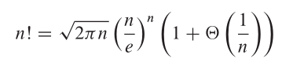

The **asymptotic** efficiency of algorithms is how the running time of an algorithm increases
with the size of the input _in the limit_, as the size of the input increases without bound.

## 1 Asymptotic notation

> Abusing asymptotic notation is useful but not to misuse it.

### Θ-notation

```
Θ(g(n)) = {f(n) : there exist positive constants c1 , c2 , and n0 such that
                  0 <= c1*g(n) <= f(n) <= c2*g(n) for all n >= n0}.
```

`g(n)` is an **asymptotically tight bound** for `f(n)` when for all `n >= n0`,
the function `f(n)` is equal to `g(n)` to within a constant factor.

**Asymptotically nonnegative**, that is, that `f(n)` be nonnegative
whenever `n` is sufficiently large.

An **asymptotically positive function** is one that is
positive for all sufficiently large `n`.

### O-notation

**An asymptotic upper bound**.

```
O(g(n)) = {f(n) : there exist positive constants c and n0 such that
                  0 <= f(n) <= c*g(n) for all n >= n0}.
```

`Θ(g(n))` is a subset of `O(g(n))`.

### Ω-notation

**An asymptotic lower bound**.

```
Ω(g(n)) = {f(n) : there exist positive constants c and n0 such that
                  0 <= c*g(n) <= f(n) for all n >= n0}.
```

**Theorem 3.1**

> For any two functions `f(n)` and `g(n)`, we have `f(n)` = `Θ(g(n))`
> if and only if `f(n)` = `O(g(n))` and `f(n)` = `Ω(g(n))`.

### Asymptotic notation in equations and inequalities

`f(n) = Θ(g(n))` is the same as `f(n) ∈ Θ(g(n))` only when
`Θ(g(n))` is standing alone.

When asymptotic notation appears in a formula, we interpret it as
standing for some anonymous function that we do not care to name.

> No matter how the anonymous functions are chosen on the left
> of the equal sign, there is a way to choose the anonymous functions
> on the right of the equal sign to make the equation valid.

### o-notation

An upper bound that is not asymptotically tight.

```
o(g(n)) = {f(n) : for any positive constant c > 0, there exists a constant
                  n0 > 0 such that 0 <= f(n) < c*g(n) for all n >= n0}.
```

```
 lim (f(n)/g(n)) = 0
n -> ∞
```

### ω-notation

A lower bound that is not asymptotically tight.

```
ω(g(n)) = {f(n) : for any positive constant c > 0, there exists a constant
                  n0 > 0 such that 0 <= c*g(n) < f(n) for all n >= n0}.
```

```
 lim (f(n)/g(n)) = ∞
n -> ∞
```

### Comparing functions

We say that `f(n)` is **asymptotically smaller** than `g(n)` if `f(n)` = `o(g(n))`,
and `f(n)` is **asymptotically larger** than `g(n)` if `f(n)` = `ω(g(n))`.

## 2 Standard notations and common functions

**Monotonicity**:

> A function `f(n)` is **monotonically increasing** if `m` <= `n` implies `f(m)` <= `f(n)`.
> Similarly, it is **monotonically decreasing** if `m` <= `n` implies `f(m)` >= `f(n)`.
> A function `f(n)` is **strictly increasing** if `m` < `n` implies `f(m)` < `f(n)` and
> **strictly decreasing** if `m` < `n` implies `f(m)` > `f(n)`.

A function `f(n)` is **polynomially bounded** if `f(n)` = `O(n**k)` for some constant `k`.

```
 lim (n**b/a**n) = 0
n -> ∞

n**b = o(a**n)
```

A function `f(n)` is **polylogarithmically bounded** if `f(n)` = `O(lg(n)**k)` for some constant `k`.

```
lg(n)**b = o(n**a)
```

**Stirling's approximation**

