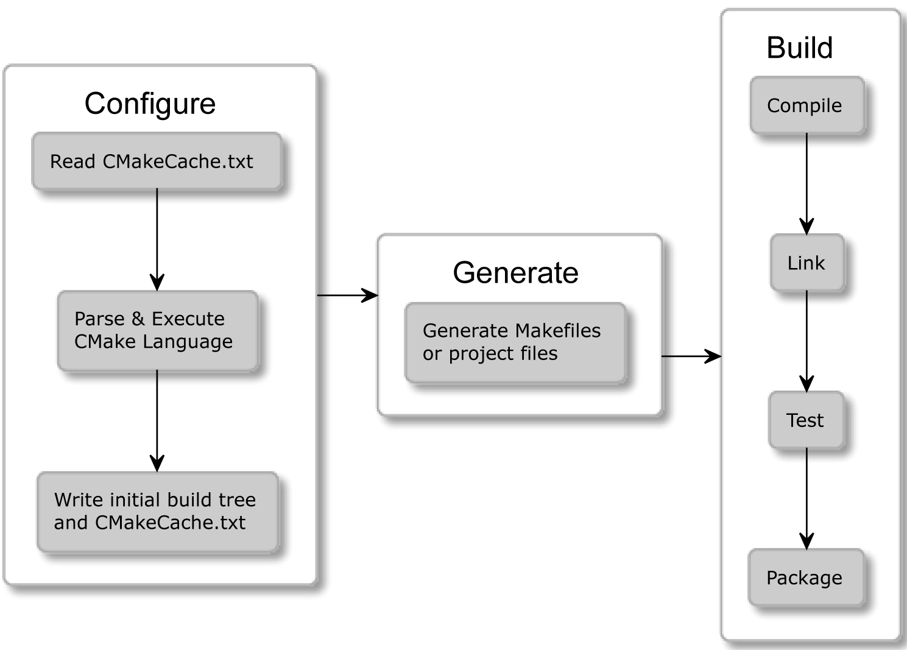
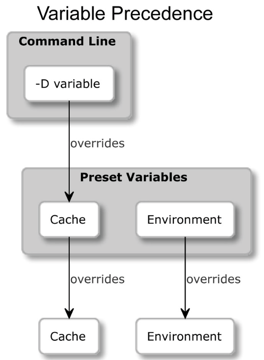

CMake is need for automation build and testing software.

Without such tool you would need to meticulously execute repetitive, error-prone tasks: invoking the correct commands, checking the syntax, linking binary files, running tests, reporting issues, and more.

## What is CMake?

CMake is a cross-platform tool for automation build C++ and C projects.

Features:

1. Project files for popular IDEs.
2. Level of abstractions (targets and projects).

## How does it work?

CMake is the orchestrator of building process.
Process consists 3 stages.

- Configuration
- Generation
- Building

### Configuration

1. Read project details in a source tree and preparing build tree for the generation stage.
2. Rind available tools and try to compile a simple test program.
3. Save info about system into CMakeCache.txt

### Generation

1. Generate a buildsystem for current enivroment.
2. Evaluating generation expressions.

### Building

1. Run the appropriate build tool.
2. Build tools produce targets with compilers, linkers and other stuff.



## CMake is a family of tools and consists of five executables:

- cmake: This is the main executable that configures, generates, and builds projects.
- ctest: This is the test driver program used to run and report test results.
- cpack: This is the packaging program used to generate installers and source packages.
- cmake-gui: This is the graphical wrapper around cmake.
- ccmake: This is the console-based GUI wrapper around cmake.

### CMake

This binary provides a few modes of operation (also called actions):

- Generating a project buildsystem
- Building a project
- Installing a project
- Running a script
- Running a command-line tool
- Getting help

#### Options for generators

```
cmake -G <generator-name>
      -T <toolset-spec> -A <platform-name>
      <path-to-source>
```

Env vars:

- CMAKE_GENERATOR for generator name
- CMAKE_GENERATOR_TOOLSET for toolset specifications
- CMAKE_GENERATOR_PLATFORM for platform name

#### Options for caching

There are a few options that allow you to manage CMakeCache.txt more conveniently.

```
cmake -C <initial-cache-script> <path-to-source>
```

Initial cache scripts is a CMake script which only contains a list of `set()` commands.

```
cmake -D <var>[:<type>]=<value> <path-to-source>
```

The `:<type>` section is optional and can be set to one of this values: BOOL, FILEPATH, PATH, STRING, or INTERNAL.
If `:<type>` wasn't specified and variable hadn't type before then it will be set to UNINITIALIZED

This command will list cached variables.

```
cmake -L[A][H] <path-to-source>
```

The `A` modifier will be add variables marked as ADVANCED to this list.
The `H` will print help messages with variables.

```
cmake -U <globbing_expr> <path-to-source>
```

This command allow you to remove variables.
The `<globbing_expr>` supports the \* wildcard and any ? character symbols.

#### Options for debugging and tracing

This command give you general information about variables, commands, macros, and other settings.

```
cmake --system-information [file]
```

To set the log level you need to use:

```
cmake --log-level=<level>
```

`<level>` can be any of the following: ERROR, WARNING, NOTICE, STATUS, VERBOSE, DEBUG, or TRACE
You can set CMAKE_MESSAGE_LOG_LEVEL to setting level permanently.

Log context.

CMAKE_MESSAGE_CONTEXT stored current context.

```
[some.context.example] Debug message.
```

In this example CMAKE_MESSAGE_CONTEXT is equal to 'some.context.example'.

This command will enable log contexts

```
cmake --log-context <path-to-source>
```

Trace mode.
In trace mode CMake will print every command with the filenames and line numbers.
To enable it use this.

```
cmake --trace
```

#### Options for presets

As developer you can simplify how users interact with your project by providing a CMakePresets.json

CMakePresets.json contains presets with some defaults.

```
cmake --list-presets
```

```
cmake --preset=<preset>
```



#### Building a project

```
cmake --build <dir> [<options>] [-- <build-tool-options>]
```

#### Parallel builds

```
cmake --build <dir> --parallel(or -j) [<number-of-jobs>]
```

You can set number of jons with setting CMAKE_BUILD_PARALLEL_LEVEL.

#### Options for target

Targes is parts of project.

To build only specific targets use:

```
cmake --build <dir> --target <target1> -t <target2> ...
```

This will remove all artifacts from the build directory:

```
cmake --build <dir> -t clean
```

```
cmake --build <dir> --clean-first
```

#### Options for multi-configuration generators

```
cmake --build <dir> --config <cfg>
```

`<cfg>` be set to: Debug, Release, MinSizeRel, or RelWithDebInfo.
The CMAKE_BUILD_TYPE variable can override `<cfg>` value.

#### Options for debugging

Use to enable verbose output:

```
cmake --verbose(or -v)
```

Also you can set CMAKE_VERBOSE_MAKEFILE for this purpose.

#### Installing a project

```
cmake --install <dir> [<options>]
```

You can specify:

1. Build type `--config <cfg>`
2. Component `--component <comp>`
3. Default permissions `--default-directory-permissions <permissions>`
   `<permissions>` is setting in format of `u=rwx,g=rx,o=rx`(unix-like permissions)
4. Prefix for path specified in the project configuration `--prefix <prefix>`

#### Running a script

```
cmake [{-D <var>=<value>}...] -P <cmake-script-file> [-- <unparsed-options>...]
```

There are two ways you can pass values to this script:

- Through variables defined with the -D option.
- Through arguments that can be passed after a -- token. CMake will create CMAKE_ARGV<n> variables for all arguments passed to the script (including the -- token).

#### Running a command-line tool

```
cmake -E <command> [<options>]
```

To get list of available command simply run `cmake -E`.

### CTest

CTest standardizes running tests and reporting for solutions built with CMake.
As user you don't need to know which testing framefork is used and you have to simply run `ctest`.

### CPack

CPack is built for the exact purpose of creating packages for different platforms.

## Navigating the project files

### Source tree (project root)

1. CMakeLists.txt is placed in top of this directory.
2. Should be managed with VSC.
3. Passed with -S to cmake.
4. Avoid hardcoding of this path.

### Build tree (build root or binary tree)

1. Binaries are generated here.
2. Should be ignored by VCS.
3. Out-of-source build.
4. Specified by -B to cmake.
5. Installation stage is recommended and it deletes all temporary build files.

### Listfiles (files which contains CMake language)

1. Can be included one in another, by calling include() and find_package(),
   or indirectly with add_subdirectory().
2. Usually have .cmake extension.
3. The following variables are set: CMAKE_CURRENT_LIST_DIR, CMAKE_CURRENT_LIST_FILE,
   CMAKE_PARENT_LIST_FILE, and CMAKE_CURRENT_LIST_LINE.

### CMakeLists.txt

1. Required at least on int root of project.
2. The first to be executed.

Should contain at least 2 commands:

1. `cmake_minimum_required(VERSION <x.xx>)`
2. `project(<name> <OPTIONS>)` (the provided name will be stored in the PROJECT_NAME variable)

Subdirectories can contain their own files CMakeLists.txt.

### CMakeCache.txt

1. Contains 2 section:
   - INTERNAL (managed by cmake)
   - EXTERNAL (meant for users to modify)
2. Delete this file = reset project to default configuration.
3. Cache variables can be read and written from the listfiles.
4. Can be managed manually, by calling cmake

### The Config-files for packages

1. Contain information regarding how to use the library binaries,
   headers, and helper tools.
2. Use the find_package() command to include packages.
3. Are named <PackageName>-config.cmake and <PackageName>Config.cmake.
4. Package's version can be specified and CMake will be check it in the associated <Config>Version.cmake.
5. CMake provides a package registry.
6. Config-files can be replaced with Find-modules.

### CMakePresets.json and CMakeUserPresets.json

CMakePresets.json - official presets, while CMakeUserPresets.json - custom user presets.

Presets are defined as maps with the following fields:

- **Generator**: This is a required or inherited string that specifies a generator to use
  for the preset.
- **architecture and toolset**: These are optional fields for configuring generators
  that support these options (mentioned in the Generating a project buildsystem
  section). Each field can simply be a string or a hash with value and strategy
  fields, where strategy is either set or external. The strategy field,
  configured to set, will set the value and produce an error if the generator doesn't
  support this field. Configuring external means that the field value is set for an
  external IDE, and CMake should ignore it.
- **binaryDir**: This is a required or inherited string that provides a path to the build
  tree directory (which is absolute or relative to the source tree). It supports macro
  expansion.
- **cacheVariables**: This is an optional map of cache variables where keys denote
  variable names. Accepted values include null, "TRUE", "FALSE", a string value,
  or a hash with an optional type field and a required value field. value can be
  a string value of either "TRUE" or "FALSE". Cache variables are inherited with
  a union operation unless the value is specified as null – then, it remains unset.
  String values support macro expansion.
- **environment**: This is an optional map of environment variables where keys
  denote variable names. Accepted values include null or string values. Environment
  variables are inherited with a union operation unless the value is specified as null
  – then, it remains unset. String values support macro expansion, and variables
  might reference each other in any order, as long as there is no cyclic reference.
- **name**: This is a required string that identifies the preset. It has to be machine-
  friendly and unique across both files.
- **Hidden**: This is an optional Boolean hiding the preset from the GUI and
  command-line list. Such a preset can be a parent of another and isn't required to
  provide anything but its name.
- **displayName**: This is an optional string with a human-friendly name.
- **description**: This is an optional string describing the preset.
- **Inherits**: This is an optional string or array of preset names to inherit from.
  Values from earlier presets will be preferred in the case of conflicts, and every preset
  is free to override any inherited field. Additionally, CMakeUserPresets.json
  can inherit from project presets but not the other way around.
- **Vendor**: This is an optional map of vendor-specific values. It follows the same
  convention as a root-level vendor field.

The following macros are recognized and evaluated:

- `${sourceDir}`: This is the path to the source tree.
- `${sourceParentDir}`: This is the path to the source tree's parent directory.
- `${sourceDirName}`: This is the last filename component of ${sourceDir}.
  For example, for /home/subado/zxc, it would be zxc.
- `${presetName}`: This is the value of the preset's name field.
- `${generator}`: This is the value of the preset's generator field.
- `${dollar}`: This is a literal dollar sign ($).
- `$env{<variable-name>}`: This is an environment variable macro. It will return
  the value of the variable from the preset if defined; otherwise, it will return the value
  from the parent environment. Remember that variable names in presets are case-
  sensitive (unlike in Windows environments).
- `$penv{<variable-name>}`: This option is just like $env but always returns
  values from the parent environment. This allows you to resolve issues with circular
  references that are not allowed in the environment variables of the preset.
- `$vendor{<macro-name>}`: This enables vendors to insert their own macros.

## Discovering scripts and modules

### Scripts

1. Platform-agnostic programming language.
2. It is recommended that you call the cmake_minimum_required()
   command at the beginning of the script.

Values passed to script will be stored in the `CMAKE_ARGV<n>` variable
and the count of the passed arguments will be in the `CMAKE_ARGC`.

### Utility modules

1. Contain macro definitions, variables, and commands that
   perform all kinds of functions.
2. To use a utility module, we need to call an include(<MODULE>) command.

### Find-modules

1. Locate different packages in the system.
2. Use by calling the `find_package(<name>)` command.
3. Defines variables (as specified in that module's manual).
