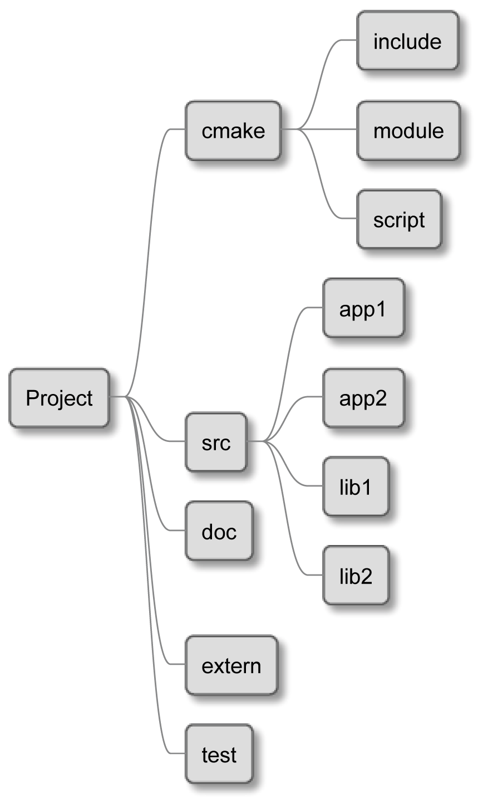
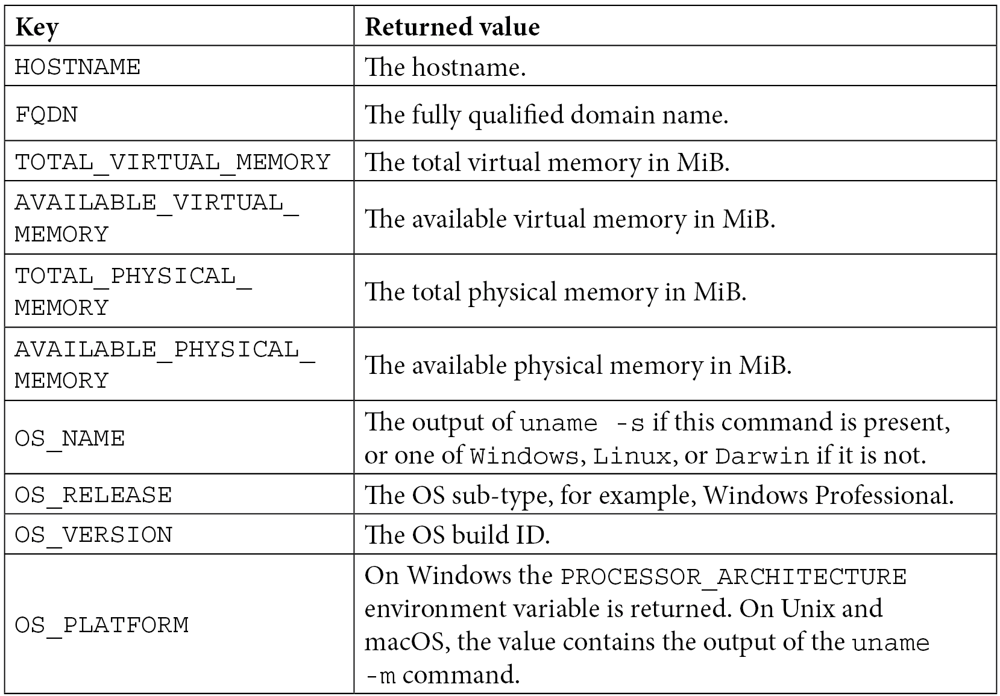
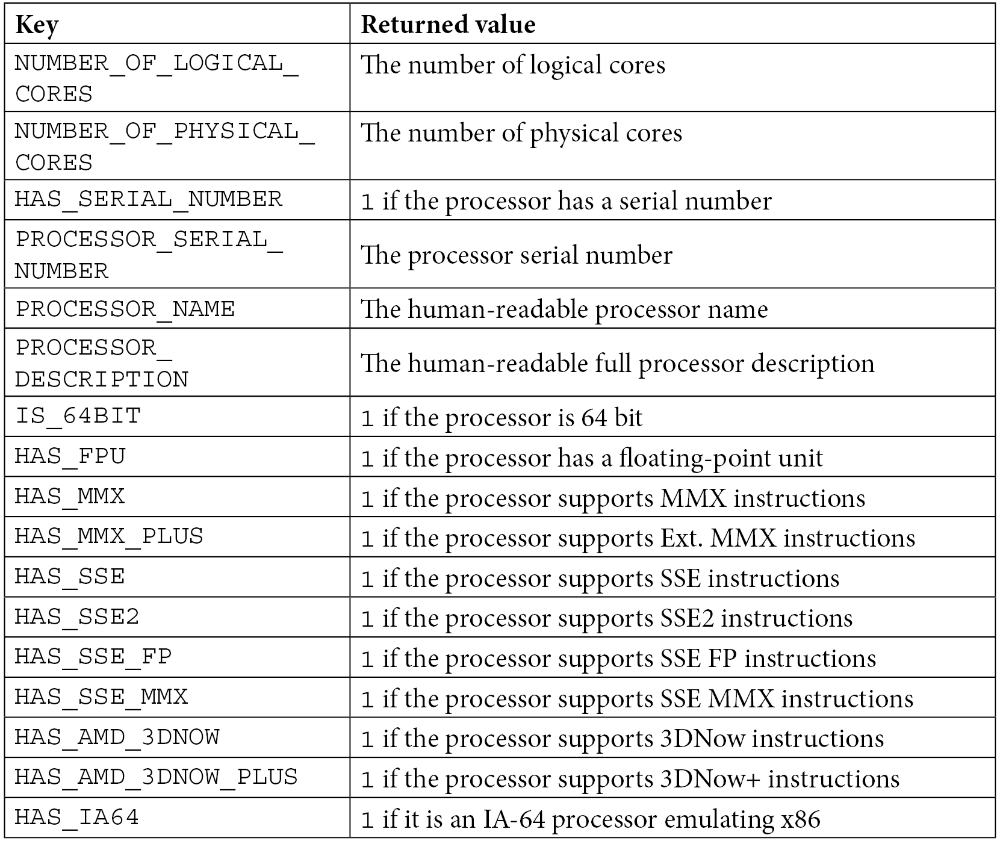

## Basic directives and commands

### `cmake_minimum_required()`

Under the hood `cmake_minimum_required()` call `cmake_policy(VERSION)`,
which will tell CMake what the right policies are to use for this project.

Whenever a backward-incompatible change was introduced in the CMake language,
it came with a policy that enabled the new behavior.

> Policies can affect every single aspect of CMake, including other important commands!

### `project()`

```cmake
project(<PROJECT-NAME> [<language-name>...])
project(<PROJECT-NAME>
[VERSION <major>[.<minor>[.<patch>[.<tweak>]]]]
[DESCRIPTION <project-description-string>]
[HOMEPAGE_URL <url-string>]
[LANGUAGES <language-name>...])
```

`project()` set the following variables:

- `PROJECT_NAME`
- `CMAKE_PROJECT_NAME` (only in the top-level CMakeLists.txt)
- `PROJECT_SOURCE_DIR`, `<PROJECT-NAME>_SOURCE_DIR`
- `PROJECT_BINARY_DIR`, `<PROJECT-NAME>_BINARY_DIR`

List of supported `LANGUAGES`: C, CXX, CUDA, OBJC, OBJCXX, Fortran, ISPC, ASM, CSharp, Java.

Specifying `VERSION`, `DESCRIPTION`, `HOMEPAGE_URL` will make the following variables available:

- `PROJECT_<VAR>`, `<PROJECT-NAME>_<VAR>`
- `CMAKE_PROJECT_<VAR>` (only in the top-level CMakeLists.txt)
- `PROJECT_<VAR>_MAJOR`, `<PROJECT-NAME>_<VAR>_MAJOR`
- `PROJECT_<VAR>_MINOR`, `<PROJECT-NAME>_<VAR>_MINOR`
- `PROJECT_<VAR>_PATCH`, `<PROJECT-NAME>_<VAR>_PATCH`
- `PROJECT_<VAR>_TWEAK`, `<PROJECT-NAME>_<VAR>_TWEAK`

There is `<VAR>` is `VERSION` or `DESCRIPTION` or `HOMEPAGE_URL`.

## Partitioning your project

Two ways to partitioning project:

1. Portioning the CMake code.
2. Moving the source files to subdirectories

**Separation of concerns**. Break your code into chunks, grouping code with closely
related functionality while decoupling other pieces of code to create strong boundaries.

An old truth in programming is that _even the worst mechanism is better than the best intentions_.

Flaws of using `include()` and included nested .cmake listfile:

1. The variables from the nested directory will pollute the top-level scope (and vice versa).
2. All of the directories will share the same configuration.
3. There are shared compilation triggers.
4. All of the paths are relative to the top-level.

### Scoped subdirectories

```cmake
add_subdirectory(source_dir [binary_dir]
[EXCLUDE_FROM_ALL])
```

The `EXCLUDE_FROM_ALL` keyword will disable the default building of targets defined in the subdirectory.

The _CMakeLists.txt_ which found in `source_dir` will be parsed in the directory scope.

> All the flaws mentioned in the `include()` method aren't present.

### Nested projects

> If we need to build independently subdirectory we have to add `project()` in the subdirectory CMakeLists.txt.

### External projects

> `load_cache()` command allows you to load values from another project's cache.

It's best to avoid this command and make a decision: should our related projects be nested,
connected through libraries, or merged into a single project?

## Thinking about the project structure

The project should have the following characteristics:

- It should be easy to navigate and extend.
- It should be self-contained – for example, project-specific files should be in the
  project directory and nowhere else.
- The abstraction hierarchy should be expressed through executables and binaries.



- _cmake_: Includes macros and functions, find_modules, and one-off scripts
- _src_: Will store the source of our binaries and libraries
- _doc_: Used for building the documentation
- _extern_: Configuration for the external projects we are building from source
- _test_: Contains code for automated tests

The CMakeLists.txt file should exist in the following directories:
the _top-level_ project directory, _src_, _doc_, _extern_, and _test_. The main listfile shouldn't
declare any build steps on its own, but instead, it should use the `add_subdirectory()`
command to execute all of the listfiles in the nested directories.

[!structure for an executable](images/executable.png)
The dir structure for an executable.

[!structure for a library](images/lib.png)
The dir structure for a library.

> As we keep adding more and more classes, we can easily group
> them in libraries to speed up the compilation process.

[!listfiles](images/listfiles.png)
How CMake merges listfiles together in a single project.

> Each time, CMake enters the new scope and executes
> commands from the appropriate listfile.

## Scoping the environment

### Discovering the operating system

`CMAKE_SYSTEM_NAME` and `CMAKE_SYSTEM_NAME` can be useful for platform specific stuff.

> Make your solutions as system-agnostic as possible.

### Cross-compilation – what are host and target systems?

The **cross-compilation** is a process of compiling code on one machine to be run on another.

The **target system** is a operating system that you're compiling for targets.
To set it use the `CMAKE_SYSTEM_NAME` and `CMAKE_SYSTEM_VERSION` variables.

The **host system** is a operating system used to perform the build.
the information on the host system is always accessible in
variables with a `HOST` keyword in their name:
`CMAKE_HOST_SYSTEM`, `CMAKE_HOST_SYSTEM_NAME`, `CMAKE_HOST_SYSTEM_PROCESSOR`, and `CMAKE_HOST_SYSTEM_VERSION`.

### Abbreviated variables

These boolean variables will be true for target system:
`ANDROID`, `APPLE`, `CYGWIN`, `UNIX`, `IOS`, `WIN32`, `WINCE`, `WINDOWS_PHONE`.

These boolean variables will be true for host system:
`CMAKE_HOST_APPLE`, `CMAKE_HOST_SOLARIS`, `CMAKE_HOST_UNIX`, `CMAKE_HOST_WIN32`.

### Host system information

```cmake
cmake_host_system_information(RESULT <VARIABLE> QUERY <KEY>…)
```




### Does the platform have 32-bit or 64-bit architecture?

The `CMAKE_SIZEOF_VOID_P` variable, and it will contain a value of 8
for 64 bits (because a pointer is 8 bytes wide) and 4 for 32 bits (4 bytes).

### What is the endianness of the system?

**Endianness** is the order of bytes in a word or the natural unit of data for a processor.

CMake will provide you with a `BIG_ENDIAN` or `LITTLE_ENDIAN` value
stored in the `CMAKE_<LANG>_BYTE_ORDER` variable, where `<LANG>` is `C`, `CXX`, `OBJC`, or `CUDA`.

## Configuring the toolchain

### Setting the C++ standard

To set a single standard across the project you can use `CMAKE_CXX_STANDARD` var.

Set C++ standard per-target:

```cmake
set_property(TARGET <target> PROPERTY CXX_STANDARD <standard>)
```

### Insisting on standard support

```cmake
set(CMAKE_CXX_STANDARD_REQUIRED ON)
```

```cmake
set_property(TARGET <target> PROPERTY CXX_STANDARD_REQUIRED ON)
```

### Vendor-specific extensions

The **plugins(Vendor-spicif extensions)** is a enhancements to the language by compiler developers.

By default is ON.

```cmake
set(CMAKE_CXX_EXTENSIONS OFF)
```

> Do it if possible, as this option will insist on having vendor-agnostic code.

### Interprocedural optimization

Modern compilers can perform optimization after linking (this is called **link time optimization**)
so that all compilation units can be optimized as a single module.

```cmake
include(CheckIPOSupported)
check_ipo_supported(RESULT ipo_supported)
if(ipo_supported)
    set(CMAKE_INTERPROCEDURAL_OPTIMIZATION True)
endif()
```

### Checking for supported compiler features

CMake will question the compiler during the configuration stage and
store a list of the available features in the `CMAKE_CXX_COMPILE_FEATURES` variable.

CMake recommend to only check if certain high-level meta-features are present:
`cxx_std_98`, `cxx_std_11`, `cxx_std_14`, `cxx_std_17`, `cxx_std_20`, and `cxx_std_23`.

### Compiling a test file

CMake provides two configure-time commands, `try_compile()` and `try_run()`,
to verify that everything you need is supported on the target platform.

```cmake
try_run(<runResultVar> <compileResultVar>
    <bindir> <srcfile> [CMAKE_FLAGS <flags>...]
    [COMPILE_DEFINITIONS <defs>...]
    [LINK_OPTIONS <options>...]
    [LINK_LIBRARIES <libs>...]
    [COMPILE_OUTPUT_VARIABLE <var>]
    [RUN_OUTPUT_VARIABLE <var>]
    [OUTPUT_VARIABLE <var>]
    [WORKING_DIRECTORY <var>]
    [ARGS <args>...])
```

## Disabling in-source build

Simple guard:

```cmake
if(PROJECT_SOURCE_DIR STREQUAL PROJECT_BINARY_DIR)
    message(FATAL_ERROR "In-source builds are not allowed")
endif()
```
