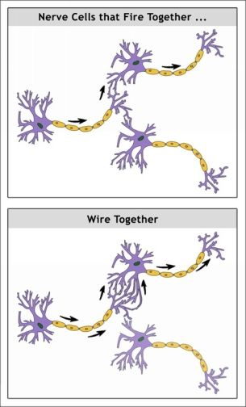

## Introduction

Today, many people (especially teenagers) feel troubles with pornography,
because pornography uses vulnerabilities of our brains to hook us.

Pornography allows us to feel pleasure in any time and
allows us to do it without embarrassment.

Many people, who has watched porn in a daily basis, reported that they are
less attracted to real three-dimensional women(men) than to two-dimensional pictures from the internet.

## 1 What Are We Dealing With?

The high-speed internet porn allows people to watch enormous amount of porn.

From the end of 2010 many men and women has shared with the internet their porn addictions.

Common Symptoms of porn addiciton:

- Interfering with life, losing control
- Inability to orgasm during sex
- Unreliable erections during sexual encounters
- Unaccustomed premature ejaculation
- Alarming porn fetish tastes
- Loss of attraction to real partners
- Effects on libido, romance
- Social anxiety, self-esteem
- Inability to concentrate
- Depression, low energy, discouragement

> ‘How serious is porn addiction?’
> say that you know a guy who had to get on Xanax in order
> to make it through the withdrawal.

## 2 Wanting Run Amok

Addiction may be thought of as wanting run amok

### Coolidge effect

> If mammals copulates with same mate, then after each reaching
> climax (orgasm) sexual arousal to each other of mates decreased.
> This happened because evolution make us wanting novelty.

An appreciation for a fine novel partner helps propel internet porn use.

### Reward circuitry

Ancient reward circuitry compels you to do things that further your
survival and pass on your genes.

At the top of our human reward list are
They contrast with

#### **Dopamine**(`wanting`):

1. Neurochemical.

2. evolutionary purpose is to motivate you to do what serves your genes.

3. is about seeking and searching for pleasure.

4. tells you what to remember by helping to rewire your brain.

5. surge for **natural reinforcers**: food, sex, love, friendship, and novelty, or
   addictive chemicals (which can hijack same circuitry).

   > Internet porn is especially enticing to the reward circuitry because
   > novelty is always just a click away.

6. if sensitivity to dophamine was deacreased, then
   you will pushed into an even more determined search for stimulation.

   > Porn goes in like a needle but comes out like a fishhook.

**Opioids**(`liking`)

### Danger lurks when something

- registers as an especially ‘valuable’, that is, exaggerated version
  of a thing that our ancestors (and we) evolved to find irresistible (high-
  calorie food, sexual arousal),
- is available conveniently in limitless supply (not found in nature),
- comes in lots of varieties (abundant novelty),
- and we chronically overconsume it.

### Sexual Conditioning

Brains are plastic, and once you wire up a new cue you have no way of
knowing when it will trigger a future reaction.

> Nerve cells that fire together wire together!

> Because plasticity is competitive, the brain maps for new, exciting images increased
> at the expense of what had previously attracted them.

### Adolescents

1. Unconsciously learning.

2. Adolescents wire together experiences and arousal much faster and
   more easily than young adults will just a few years later

3. Our most powerful and lasting memories arise from
   adolescence – along with our worst habits

4. Reward circuitry is in overdrive.

5. More sensitive to dopamine and their brains produce more DeltaFosB.

### Addiction

A adaptation that may arise from excessive porn consumption is **addiction**.

Test:

- **craving** and preoccupation with obtaining, engaging in or
  recovering from the use of the substance or behaviour;
- loss of **control** in using the substance or engaging in the
  behaviour with increasing frequency or duration, larger amounts
  or intensity, or in increasing the risk in use and behaviour to
  obtain the desired effect; and
- negative **consequences** in physical, social, occupational, financial
  and psychological domains.

Protein **DeltaFosB** initiates key addiction-related brain changes (and thus
behaviours) in both chemical and behavioural addictions.
**DeltaFosB** turns on a very specific set of genes
that physically and chemically alter the reward centre.

> Whatever amount of stimulation causes the accumulation of
> **DeltaFosB** and corresponding addiction-related brain changes.

> More porn use correlated with less gray matter and reduced
> reward activity (in the dorsal striatum) when viewing sexual images. More
> porn use also correlated with weakened connections to the seat of our
> willpower, the frontal cortex.

> Both cue-reactivity and a reduced pleasure response
> are often seen in addicts of all kinds.

#### Some brain changes that show up in all addictions:

1. **Desensitisation**, or a numbed response to pleasure.

2. **Sensitisation**, or an unconscious super-memory of pleasure that,
   when activated, triggers powerful cravings.

3. **Hypofrontality**, or reduced brain activity in the prefrontal regions,
   which weakens willpower in the face of strong subconscious cravings.

4. **Dysfunctional stress circuits**, which can make even minor stress
   lead to cravings and relapse because they activate powerful sensitised
   pathways.

#### A decline in dopamine signalling is associated with all of these:

- **Diminished sexual behaviour**, which, as noted, is a possibl1
  cause of sluggish erections/climaxes. (**ED**)

- **Decreased risk-taking and increased anxiety**, combined with a
  tendency toward angry overreaction, any of which can decrease
  willingness to socialize.

- **Inability to focus**, which can account for concentration and
  memory problem.

- **Lack of motivation and healthy anticipation**, which can lead to
  apathy, procrastination, and even play a role in depression.

## 3 Regaining Control

### Recommended Suggestions

1. **Managing access**

- Remove all porn

- Move your furniture around

  (because your environment can be associated with porn)

- Consider a porn blocker and an ad blocker

  (may be dangerous for gamers)

- Consider a day-counter

  (you need to realise that counted days aren't game points)

- Extinction training (not for everyone)

  (You weaken the link or
  pathway between a stimulus and a habitual response.)

2. **Support**

- Join a forum, get an accountability partner

- Therapy, support groups, healthcare

- Keep a journal

  (A journal will help you to look on your way and your progress)

3. **Managing Stress, Improving Self-control and Self-care**

- Exercise, beneficial stressors

  (Acute bouts of exercise increase dopamine
  concentrations, and regular exercise leads to sustained increases in
  dopamine and related adjustments.)

  Maybe you should take a cold shower.

- Get outside

- Socializing

- Meditation, relaxation techniques

  (increase willpower)

- Creative pursuits, hobbies, life purpose

4. **Attitude, Education and Inspiration**

- Be gentle with yourself

  (Accept your humanness and love sex)

- Learn more about what’s going on in your brain

- Keep yourself inspired

### Rebooting Challenges

1. **Withdrawal**

   (You will be more emotional)

2. **Flatline**

   > The gruelling, mysterious
   > initiation one endures but never speaks of.

   The **flatline** is a temporary loss of libido.

3. **Insomnia**

   > It's important to stay well rested as
   > fatigue can trigger porn use.

4. **Triggers**

   > The external factors that make you
   > think about porn.

   When you feel The Urge, ask yourself:

   - What emotions I am feeling?
   - What time is it?
   - Who else is around?
   - What did I just do?
   - Where I am?
   - What could I do instead that would meet my needs?

5. **Emotions**

   > People who quit porn often remark
   > that they feel more emotions.

6. **Chaser**

   The term **chaser** is often used to describe intense cravings that
   sometimes follow orgasm

7. **Disturbing dreams, flashbacks**

   > Vivid dreams seem to be a normal part
   > of the mental housecleaning
   > process of unhooking.

8. **Shame cycle**
   A ‘shame-binge-shame’ cycle exist due to the fact, that
   dopamine rises sharply when you feel shame.

### Common Pitfalls

1. **Edging**

   **Edging** is masturbating up to the edge
   of orgasm, repeatedly, without climaxing.

2. **Fantasising**

   Fantasising or imagining an experience activates many
   of the same neural circuits as performing it.

3. **Using porn substitutes**

4. **Forcing sexual performance prematurely (ED)**

   > Those with porn-related sexual dysfunction often find that
   > they heal faster if they allow their libido to reawaken naturally.

5. **Assuming a fetish is permanent**

   > Only by process of elimination will you know whether you
   > are dealing with a porn-induced superficial 'fetish' or a true fetish
   > arising from the core of your sexual identity.

6. **The bad urge**

   > The fact is that all urges die down eventually,
   > usually within quarter of an hour.

### Common Questions

- **How long should I reboot?**

  Time is specific for particular person because brains are different.

- **Can I have sex during my reboot?**

  Some people find a temporary time-out from all
  sexual stimulation gives the brain a much needed rest and speeds
  recovery.

- **Should I reduce masturbation?**

  It is better if you give masturbation a rest for a while.

- **How do I know when I'm back to normal?**

  - You feel like flirting with potential mates, who look a lot more
    attractive.

  - You are getting morning wood (or ‘semis’) frequently.

  - You can orgasm without an intense chaser effect.

  - Intercourse with a partner feels fantastic (Note: You may have a
    bit of premature ejaculation or delayed ejaculation early on. Practice
    makes perfect.)

  - Your libido changes

- **How do I know that I don't just have a high libido?**

  Give up porn and porn fantasy and see what
  your libido is like a few weeks later.

- **How can I get excited by real partners? (ED)**

  Spend time around real potential partners and
  limit all sexual fantasy to real people and realistic sexual scenarios.

## Concluding Reflections

Here is the schema:

1.  Exciting, but bad-in-long-term behaviour is introduced for money.
2.  People get hooked.
3.  Precise, scientifically backed-up research takes decades to kick-in.
4.  Hooked people start to get educated.
5.  They start behaviour-elimination.
