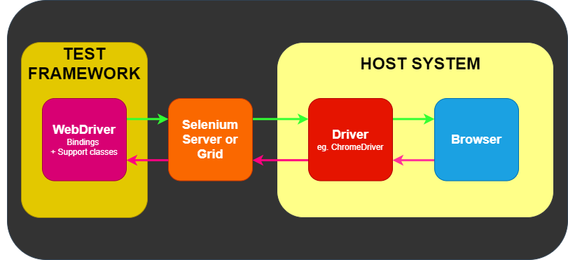

**Web scraping** is the practice of gathering data by writing an automated program that doesn't use an API.

Web scrapping is used when:

- server's API is insufficient for your purposes
- a server doesn't have API, but you need data from it

## 1 Your First Web Scraper

We will use the default Python urllib library and the not-default BeautifulSoup4 library.

```python
from urllib.request import urlopen
from bs4 import BeautifulSoup
html = urlopen('url') # getting html from a url
bs = BeautifulSoup(html.read(), 'html.parser') # parsing html
print(bs.tag) # printing the first 'tag' in html
```

### BS4

The BeatifulSoup is needed, because it parses html and transforms it into very useful object.

For example.
If it is our html:

```html
<html>
  <head> </head>
  <body>
    <div>zxc</div>
    <div>bomb</div>
  </body>
</html>
```

Then all of these function calls produce the same output, "zxc", because the first `<div>` tag contains "zxc".

```python
bs.div
bs.html.div
bs.body.div
bs.html.body.div
```

### Parsers

In our example, we used a `html.parser`, but there are some other parsers:

- `lxml`
  1.  It is more forgiving than then default `html.parser`;
  2.  The fastest popular parser;
  3.  Have external dependencies.
- `html5lib`
  1.  It is more forgiving than the `lxml`;
  2.  The slowest parser;
  3.  Have external dependencies.

`html.parser` is the default Python parser, and it doesn't have external dependencies.

### Exceptions

Errors detected during execution are called **exceptions**.

When an exception is not handled, the program crashes with an error message.
To handle exception we have to use `try` statement.

In our program, we have some unhandled exceptions, and they can cause unexpected finishing of the program.

Correct code:

```python
from urllib.request import urlopen
from urllib.error import HTTPError
from urllib.error import URLError
from bs4 import BeautifulSoup
try:
    html = urlopen('url') # getting html from a url
except HTTPError as e:
    print(e)
except URLError:                            # This line can be omitted because if the server doesn't exist, then
    print('The server could not be found!') # the bs object will be NoneType and it cause an AttributeError.
else:
    print('It Worked!')
try:
    bs = BeautifulSoup(html.read(), 'html.parser') # parsing html
    print(bs.tag.innerTag) # printing the first 'tag.innerTag' in html
except AttributeError:                   # Here I printed 'AttributeError' because if 'tag' doesn't exist, then 'tag' will
    print('The tag was not found!')      # have NoneType, and accessing 'tag.innerTag' gives this exception.
```

## 2 Advanced HTML Parsing

### Options

If a website which you want to scrap is really weird:

- Look for a “Print This Page” link, or perhaps a mobile version of the site that has
  better-formatted HTML.

- Look for the information hidden in a JavaScript file. Remember, you might need
  to examine the imported JavaScript files in order to do this.

- The information might be available in the URL of the page itself.

- Is there another website with the same data? Is this website displaying
  data that it scraped or aggregated from another website?

### BS4 functions

- `find_all(tag, attributes, recursive, text, limit, keywords)`

  - `tag` is a string name of a tag
    or even a Python list of string tag names.
  - `attributes` is a Python dictionary of HTML attributes.
    A tag will be correct if it has any one of those attributes.
    (It works like `or`).
  - `recursive` is a boolean value.
    If it is `True` then all tags will be looked at.
    Otherwise only top-level tags will be looked at.
  - `text` is a string value.
    If the tag's text content has a `text` string, then it will be matched.
  - `limit` is an integer value that controls the number of matched tags.
  - `keywords` it is like `attributes` but
    it is a \*\*kwargs, and it works like `and`.
    It is not very useful. It is better to use regexes or lambdas.

- `find(tag, attributes, recursive, text, keywords)`
  It is like `find_all` with limit equal to 1.

Also you can pass a labmda expression to `find` functions. This lambda must return a boolean value and take a tag object.

#### Parents

**Parents** of a tag are tags that contain this tag at any level.
The **parent** of a tag is tag that contain this tag at the first level.

The BS4 provides `parent()` and `parents()` functions.

#### Descendants

**Descendants** are tags that are any level below a parent tag in the tree.
**Children** are descendants that are only one level below a parent tag in the tree.

The BS4 provides `children()` and `descendants()` functions.

#### Siblings

**Sibling tags** are children tags of common parent.

The BS4 provides `next_siblings()`, `next_sibling()`, `previous_siblings()` and `previous_sibling()` functions.

### Regular Expressions

**Regular expressions** are patterns that are used to identify regular strings.
A **regular string** is a string that can be generated by a series of linear rules.

| Symbol(s) | Meaning                                                                                  |
| --------- | ---------------------------------------------------------------------------------------- |
| \*        | Matches the preceding char 0 or more times.                                              |
| +         | Matches the preceding char 1 or more times.                                              |
| []        | Matches any char within brackets.                                                        |
| ()        | A grouped subexpression that are evaluated first.                                        |
| {i, n}    | Matches the preceding char between `i` and `n` times.                                    |
| [^]       | Matches any char that is not in brackets                                                 |
| \|        | A pipe. Matches any expression separated by \|. (It is like `or`)                        |
| .         | Matches any single char.                                                                 |
| \\        | Used to escape reserved symbols.                                                         |
| ^         | Indicates that a expression occurs at the beginning of a string.                         |
| $         | Indicates that a expression occurs at the end of a string.                               |
| ?!        | indicates that that char should not be found in that specific place in the larger string |

## 3 Writing Web Crawlers

**Web crawlers** are called such because they crawl across the web.
Web crawlers crawl using links on pages.

Web scrapers that traverse an entire site are good for many things, including the following:

1. Generating a site map
2. Gathering data

Before writing a stupid code, you should spend time trying to simplify the problem.

Before writing a code, you need to sketch out the flow diagram of your future program.

It is important to use some data structure(e.g. `set`) to avoid traversing a link more than once.

Before you start writing a crawler that follows all outbound links willy-nilly, you
should ask yourself a few questions:

- What data am I trying to gather? Can this be accomplished by scraping just a few
  predefined websites (almost always the easier option), or does my crawler need to
  be able to discover new websites I might not know about?
- When my crawler reaches a particular website, will it immediately follow the next
  outbound link to a new website, or will it stick around for a while and drill down
  into the current website?
- Are there any conditions under which I would not want to scrape a particular
  site?
- How am I protecting myself against legal action if my web crawler catches the
  attention of a webmaster on one of the sites it runs across?

> Exception handling is very important stuff!!!

## 4 Web Crawling Models

1. You have to understand what data you actually need.
   To achieve this, you have to compare some websites that have required data.
   Optional data may be stored in the field named attributes.
2. Instead of writing standalone function to get data from each site
   you can normalize data from sites and write code, in which websites' specifics
   will be presented like function arguments.
   The `BeautifulSoup.select()` will help you.
3. There are a few basic ways to identify the page type:
   - By the URL
   - By the presence or lack of certain fields on a site
   - By the presence of certain tags on the page to identify the page

> Dealing with data with identical
> and comparable fields is much easier than dealing with data that is completely
> dependent on the format of its original source.

## 5 Scrapy

**Scrapy**(/ˈskreɪpaɪ/) is an application framework for crawling web sites and
extracting structured data which can be used for a wide range of useful applications,
like data mining, information processing or historical archival.
[[docs](https://doc.scrapy.org/en/latest/)]

**Spiders** are classes which define how a certain site (or a group of sites) will be scraped,
including how to perform the crawl (i.e. follow links) and
how to extract structured data from their pages (i.e. scraping items).

- The `scrapy.spiders.Spider` is the simplest spider, and the one from which every other spider must inherit.

- The `scrapy.spiders.CrawlSpider` is the most commonly used spider for crawling regular websites,
  as it provides a convenient mechanism for following links by defining a set of rules.

Spiders may return the extracted data as **items**, Python objects that define key-value pairs.

The `scrapy` supports different types of data output formats(CSV, JSON, or XML).

After an item has been scraped by a spider, it is sent to the **Item Pipeline**
which processes it through several components that are executed sequentially.
By default pipeline is disabled, but it can be activated if necessary.

A `LOG_LEVEL` of `scrapy` output can be changed.

## 11 Scraping JavaScript

### What kind of beast is JS?

**JavaScript (JS)** is a lightweight interpreted (or just-in-time compiled) programming language with first-class functions.
While it is most well-known as the scripting language for Web pages.
Many modern websites use JS for scripts that are executing on the client-side and are making the site more interactive.

To make page more interactive without reload it, websites developers use **AJAX** that is stands for
**Asynchronous JavaScript and XML** and that is a web development technique in which a web app
fetches content from the server by making asynchronous HTTP requests, and uses the new content to update
the relevant parts of the page without requiring a full page load.

If developers of the site, which you want to scrap, used AJAX, then
it may lead to getting by your bot HTML, which doesn't contain all needed information, due to the fact that
some website's content load using JS, but your bot didn't run JS.

### Redirects

**Client-side redirects** are page redirects that are executed in your browser by JavaScript,
rather than a redirect performed on the server(**server-side redirects**), before the page content is sent.
Cliet-side redirects are common nowadays.

Client-side redirects lead to getting by your bot empty HTML, because of
getting by your bot HTML before redirection, but if your bot doesn't execute JS then
this redirection be never happened.

### Using selenium to deal with JS

**Selenium** is a toolset for web browser automation that uses the best techniques available to remotely control browser instances and emulate a user’s interaction with the browser.

Selenium provides the abstract interface, which hides browser implementation from you
and allows you to run same tests with different browsers.

### How it works?

**WebDriver** is a remote control interface that enables introspection and control of user agents.
It provides a platform- and language-neutral wire protocol as a way for
out-of-process programs to remotely instruct the behavior of web browsers.

Selenium **WebDriver** refers to both the language bindings and
the implementations of the individual browser controlling code.

Selenium WebDriver is a [W3C Recommendation](https://www.w3.org/TR/webdriver1/).

**Driver** is an interface that is responsible for controlling the actual browser.
Some people refer to the drivers as proxies.

This example of **direct communication**.


This example of **remote communication**.


This is another example of remote communication, where selenium server or selenium grid is used.



### Basic examples and recommendations

Running browser in headless(without GUI) mode.

```python
from selenium import webdriver
from selenium.webdriver.firefox.options import Options

options = Options()
options.add_argument('--headless') # argument will added to the command that runs a browser
driver = webdriver.Firefox(options=options)
driver.get('MrRobot.Eliot')
driver.close()
```

Handling client-side redirection(loading pages).

```python
from bs4 import BeautifulSoup
from selenium import webdriver
from selenium.webdriver.firefox.options import Options
from selenium.webdriver.common.by import By
from selenium.webdriver.support.ui import WebDriverWait
from selenium.webdriver.support import expected_conditions as EC

driver = webdriver.Firefox()
driver.get('Loneliness.Cameback')

try:
    WebDriverWait(driver, 10).until(    # 10 is a timeout. selenium.common.exceptions.TimeoutException will be raised if timeout occurs
        EC.presence_of_element_located((By.TAG_NAME, 'h1'))) # Imagine that only full loaded site has h1 tag
finally:
    bs = BeautifulSoup(driver.page_source, 'html.parser')
    print(bs.h1)
    driver.close()
```

Very long full loading of page([docs](https://www.w3.org/TR/webdriver1/#navigation)).

```python
from bs4 import BeautifulSoup
from selenium import webdriver
from selenium.webdriver.firefox.options import Options
from selenium.webdriver.common.by import By
from selenium.webdriver.support.ui import WebDriverWait
from selenium.webdriver.support import expected_conditions as EC

options = Options()
options.set_capability('pageLoadStrategy', 'none') # default value is `normal`
driver = webdriver.Firefox(options=options)

driver.get('HateYourself.Truly')

try:
    WebDriverWait(driver, 10).until(
        EC.presence_of_element_located((By.TAG_NAME, 'h1'))) # A page, that has h1 tag, is enough for our goals
finally:
    bs = BeautifulSoup(driver.page_source, 'html.parser')
    print(bs.h1)
    driver.close()
```

Read the fucking [docs](https://www.selenium.dev/selenium/docs/api/py/api.html)!

## 14 Avoiding Scraping Traps

Some websites may want to block **bots** (programs that do web scraping),
because bots can spam or cause server loads to be abnormal.

### How to avoid all websites' traps?

1. Change your headers.
   Especially `User-Agent`, `Accept` and `Accept-Language` fields(maybe `Accept-Encoding` also).
2. Save cookies to stay in login state.
3. Set delays.
   You have to use `sleep` function because the website may block your IP
   due to your abnormally rapid interaction with the site.
4. Deeply analazy site's html.
   Websites may have **honeypots** that are hidden fields to trick bots.
   This fields may be:
   - hidden forms filds that cause bot's `POST` requests to be incorrect.
   - hidden links or input after interacting with which bot's IP will be blocked.

### How to recognize that traps while scraping?

1. The page that your bot got to differ from HTML that you see in the browser.
2. A bot has an HTTP error when it is trying to get HTML.
3. After loading a new website page, bot need to login again.
