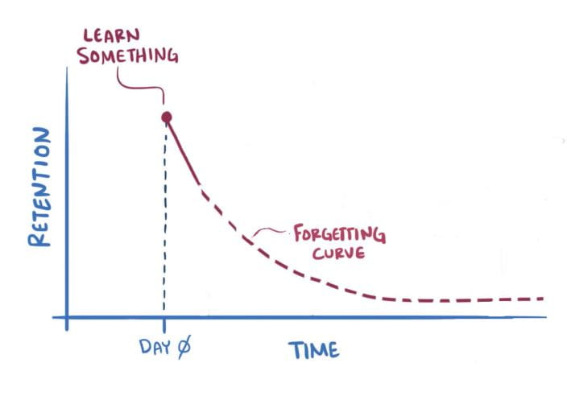
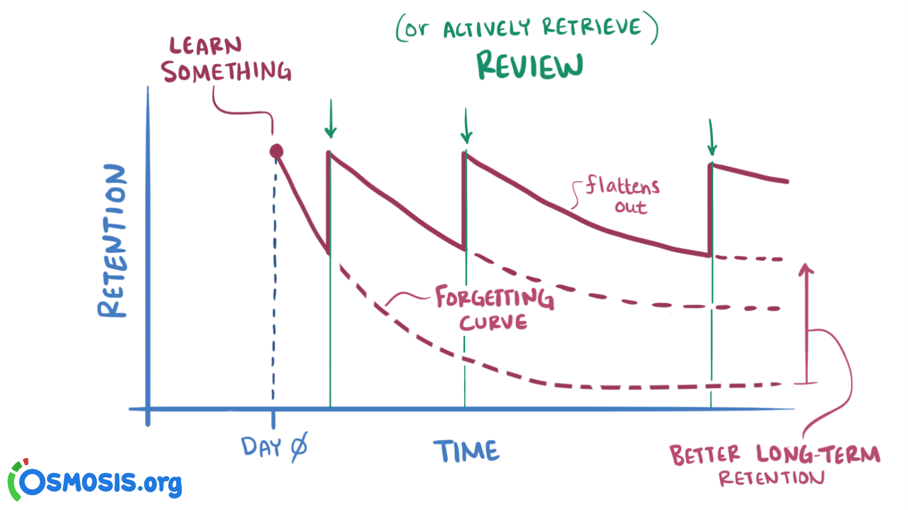
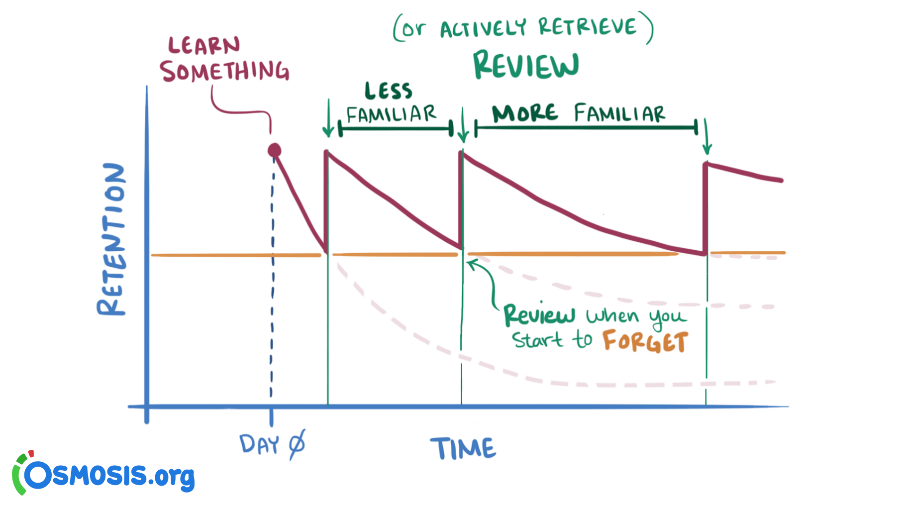

Many people know this 2 facts:

1. Reviewing information multiple times helps us remember it better.
2. Different memories fade with different rates, not all at once.

#### Spaced repetition



Process of forgetting start after we learn something. It happens gradually.



Periodic reviews slows down the rate at which we forget information.



Longer intervals are used for familiar content, while shorter intervals are used for unfamiliar content.

Manual tracking forgetting curve of each piece of knowledge is an impossible task.

Spaced repetition algorithms are used to automation of the tracking of memory states and arraging efficient review schedules.

#### SM-0

In 1985, young student Piotr Wozniak was struggling with problem of forgetting.

```
I(1) = 1 day
I(2) = 7 days
I(3) = 16 days
I(4) = 35 days
for i>4: I(i) = I(i-1) * 2
```

Words forgotten in the first four reviews were moved to a new page and cycled back into repetition along with new materials.

In 1986, Wozniak simulated the model and drew two key conclusions:

- Over time, the total amount of knowledge increased instead of decreasing
- In the long run, the knowledge acquisition rate remained almost unchanged

**primary limitation**: he used page of notes as the unit for review, because of that algorithm is impossible to use at a more granular level.

#### SM-2

Issues of SM-0:

1. Reviewing doesn't always make him more familiar with the material.
2. Not all material is equally hard.

Details of SM-2:

1. Break down the information you want to remember into small question-answer pairs.
2. Use the following intervals (in days) to review each question-answer pair:

```
   I(1) = 1
   I(2) = 6
   For n > 2, I(n) = I(n-1) * EF
   EF — the Ease Factor, with an initial value of 2.5
   After each review, newEF = EF + (0.1 - (5-q) * (0.08 + (5-q) * 0.02))
     - newEF — the post-review updated value of the Ease Factor
     - q — the quality grades of review, ranging from 0 - 5. If it's >= 3, it means the learner remembered, and if it's < 3, the learner forgot.
   If the learner forgets, the interval for the question-answer pair will be reset to I(1) with the same EF.
```

#### SM-4

Isseues of SM-2:

1. Adjustments to each flashcard's schedule are made in isolation, the algorithm doesn't "see" the user's memory as a whole.

Details of SM-4:

1. Optimal Interval Matrix
2. Dynamic interval-adjustment rules

```
If the learner exhibits good recall over extended intervals, the original interval should be longer, and vice versa.
```

Issues of SM-4:

1. It takes too long to improve entire matrix.
2. For longer intervals, it takes a long time to gather enough data to fill the corresponding matrix entry
